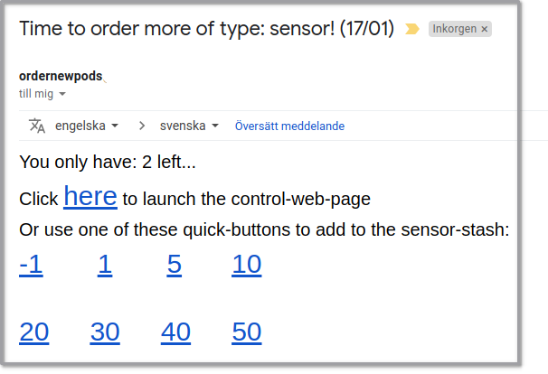
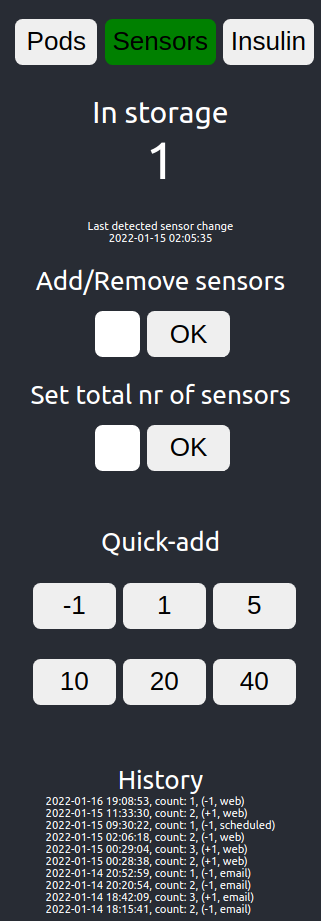

# Overview
- This app helps you to keep track of your personal storage of omnipods/sensors and insulin cartridges.
- You manually enters how many pods/sensors/cartridges to add when you stock up, and the app automatically reduces the counter when it tracks a pod- or sensor-change from the NS-database. You'll have to manually enter when you discards an insulin chartidge.
    - This is only tested with AAPS/Omnipod/dexcom G6, which enters this data automatically at every change, but I've heard that ios-loop users enters this manually in NS!? Hopefully it looks the same in the NS-db - othervice I'll need to tweek the code to also cover loop! 
- When one of the three tracked items runs low (less than a threashold value selected by you), you'll get notified with an email telling you to stock up! 
- The email contains direct links to either add 1, 5 or 10 items, or open up the controller web-site where you can click on buttons and see status. 

Email example (Language: English or Swedish supported)



Web-site:



- The app connects directly to your Nightscout database once a day to search for pod/sensor-changes and saves this info in a separate table (not touching the NS-data!). The table is really light weight and will not affect your db usage noticable!
- You don't need to worry that this app will eat up all of your free dynos in Heroku since it is only active once a day for 30min to check if you need notification or not (plus a fiew 30-mins when you opens upp the site to alter values). Because of this, it takes a while for the site to load when you haven't used it for a while (~10s)...
Fair price to pay for hosting a free site!


# Installation on Heroku
## App installation
1. Make a fork of this git-repo to your github 
    - You must be logged in to your github account!
    - Fork button (located top right)
2. log into your account at [heroku.com](https://dashboard.heroku.com/) (same as you use to host NightScout)
3. Click the "New" button (upper right side) => "Create new app"
4. Choose App-name which will be the url to the site for example: mynamediabetesstash (url will be: mynamediabetesstash.herokuapp.com)
5. leave region to United States => create app
6. Under tab "Deploy" and left side "Deployment method" choose GitHub
7. Since you're already connected from your Nigtscout-app - click purple "Search" button to list all of your repos, locate the omnipod-stash-fork-repo and hit the "Connect" button that appears next to it.
8. Scroll down to the very bottom and hit "Deploy Branch" (still having the "master"-branch selected) to install the app

## Enter config vars
Now you need to enter the Config-vars (same as you did with Nightscout)
1. You need the MONGODB_URI that you have entered in Nightscout app, so press "Personal" button on the top left to change app.../Settings/"Reveal config vars" and copy the MONGODB_URI value ("mongodb+srv://..........)

2. Go back to your omnipod-stash-app and "Settings"-tab/"Reveal config vars" 
3. Add these vars: (key value) => "Add"
    - **CONNSTR_mongo** = (the one you copied from NS: "MONGODB_URI" = mongodb+srv://.........)
    - **HEROKU_APP_NAME** = Same as the one you choose for the app. 

    - **FROM** = **ordernewpods** (use this if you do not know what you're doing...)
    - **EMAIL_TO** = (comma separated list of emails to get notification)

    Optional parameters (3 is default value for these ones => less than 3 pods/sensors/insulin will send you and email per day!)
    - **LANGUAGE** = ENG (deafults to email text in swedish...)
    - **INSULINLIMIT** = 3
    - **PODLIMIT** = 3
    - **SENSORLIMIT** = 3

## Heroku Scheduler
To get you app to update/check your stash once a day, you need to setup a Task scheduler.
1. Open the "Resources"-tab and in the Add-ons searchbox type "heroku scheduler" and click on it
2. Make sure you have the "Standard - Free"-plan selected (default) and press "Submit order from" 
3. Click on the newly added "Heroku Scheduler" (opens up new side)
Now repete these steps for the ones you'd like to get updates/notifications from: (pod/sensor/insulin)
4. "Create job"
5. "Every day at..." - and select a time 
6. after the $ paste one of the three tasks: 
    - checkPodState
    - checkSensorState
    - checkInsulinState
7. click "save job" and repeat by clicking "Add Job" (top right)


# Technical Overview (you can stop reading here...)
This app consists of 3 parts: 
1. Api-backend that handles conection to the database
2. A single page app (frontend) that lets the user alter current nr of items
    - calls the api-backend to access the NS-db
3. A Heroku scheduled task that polls the NS-db for pod-changes and updates the count of used pods. 

For now this app does not require a sign in because it only allows the client to update the app-specific table keeping track of the number of pods left in the NS database. Not much fun for a hacker since the only thing you can do with this app is to update your counter of pods so that in worst case scenario you'd get a notification telling you that you're out of pods even if you're not.  

# debug in visual studio code
## To debug the server/index.js with breakpoints
(breakpoints will not work in the frontend-app!)
1. build the react frontend first with: 
    - `cd frontend`
    - `npm run build` 
2. run use the configuration "Launch backend" (.vscode/launch.json) with f5 (see bellow) no need to manually run "npm start" first!
```
"configurations": [
    {
        "type": "node",
        "request": "launch",
        "name": "Launch backend",
        "skipFiles": ["<node_internals>/**"],
        "program": "${workspaceFolder}/server/index.js",
    },
    {
        "type": "node",
        "request": "attach",
        "name": "Attach to backend",
        "port": 5000
    },
]
```
## to debug the /frontend-react app 
open the /frontend-folder in different vscode and run its debug config separately!
1. start the app with `npm start` in terminal and close the browser that opens
2. run the "Launch Chrome debug"-config in the frontend/.vscode/launch.json with f5:
```
"configurations": [
    {
        "type": "pwa-chrome",
        "request": "launch",
        "name": "Launch Chrome debug",
        "url": "http://localhost:3000",
        "webRoot": "${workspaceFolder}"
    }
]
```
# run scheduled task in Heroku
- task needs to be placed under /bin/-folder and without file-ending
- task is a node file and has a start-line of `#! /app/.heroku/node/bin/node` and ´process.exit();´ to close the runner when finnished. 
- When deployed to heroku, test by "More"-button/"Run Console" and run the filename in the "heroku run"-box.'
- test script by creating copy with file-ending .js and remove the first line, and test with `node testfile.js`
